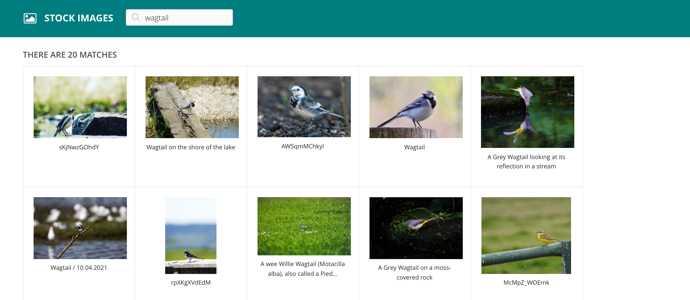
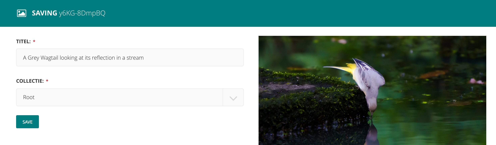

# Wagtail Stock Images

[](https://pypi.python.org/pypi/wagtail-stock-images/)


Search stock images (e.g. via Unsplash) and save them to your Wagtail image library.




## Requirements

- Python 3
- Django >= 2
- Wagtail >= 3

## Installation

Install the package

```
pip install wagtail-stock-images
```

Add `wagtail_stock_images` to your `INSTALLED_APPS`

```python
INSTALLED_APPS = [
    ...
    "wagtail_stock_images",
]
```

## Settings

`WAGTAIL_STOCK_IMAGES_SEARCH_ENGINE`

Default: `wagtail_stock_images.contrib.unsplash.UnsplashSearchEngine`

## Available search engines

### Unsplash

```python
WAGTAIL_STOCK_IMAGES_SEARCH_ENGINE = "wagtail_stock_images.contrib.unsplash.UnsplashSearchEngine"
WAGTAIL_STOCK_IMAGES_UNSPLASH_CLIENT_ID = ""
WAGTAIL_STOCK_IMAGES_UNSPLASH_CLIENT_SECRET = ""
WAGTAIL_STOCK_IMAGES_UNSPLASH_REDIRECT_URI = ""
```

## Custom search engine

```python
from wagtail_stock_images.engine import AbstractSearchEngine

from MyCustomSearchEngine(AbstractSearchEngine):
    ...
```
